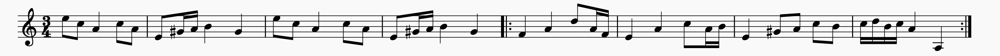
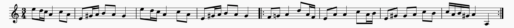
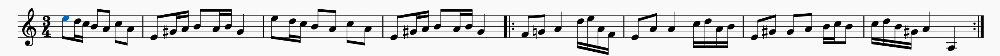
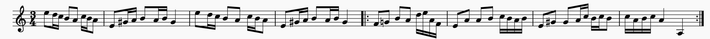
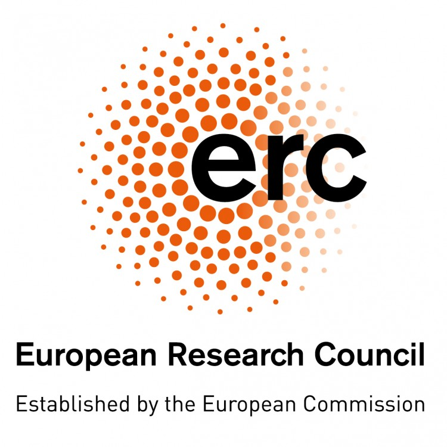

## DCML submission to the AI Music Challenge 2021 (Interval Tree Model)

We designed a rule based model to generate Slängpolska iteratively in a controllable manner.
The user can specify the harmony, coherence (similarity among bars), phrase ending, cadence type, rhythmic density, across multiple levels.

Pieces are first generated in either C major or A minor and then transposed to D major and A minor.

## Usage
**Dependencies**
- numpy: for numerical computation.
- music21: for building musicxml and midi files from custom melody representation.

**Reproducing the generated pieces**

To generate all the 1000 Slängpolska pieces in both `.xml` and `.mid` format,
run `code/tree_model/run.py`, which put the generated pieces to the two folders: `code/tree_model/generated_midi` and `code/tree_model/generated_xml`. 
The generation process should take less than 5 mins. 

## File Description
**For melody skeleton generation**

`form.py` defined the class for the tree representation of form as well as two specific form called "sentence" and "period" in both major and minor.

`template.py` contains helper functions for preprocessing melody skeleton.

**For melody elaboration**

`melody.py` defines the class for the interval tree representation of melody.

`operation.py` defines all the operations that can be used on a melody during the melody elaboration process.

`tree_policy` defines the policies for determining which action to use given the current state of the melody during the elaboration process

## Model Description

#### Stage 0: Specifying form

The input of the model is a collection of form templates (currently four), which specified the following information on the bar level:
- Harmony
- Marker for coherence structure (which bars should be the exact copy, or similar, or different from each other)
- Flag for phrase ending
- Flag for cadences (perfect authentic cadence or half cadence)
- Number of maximum elaboration (to enable the control of rhythmic density)

an example form template:

| info \ position|1|2|3|4|5|6|7|8
|---|---|---|---|---|---|---|---|---|
|harmony|I|V|I|V|IV|cad64|V|I
|coherence marker|a|b|a|b|c|c'|c''|d
|phrase ending flag|-|True|-|True|-|-|-|True
|cadence flag|-|-|-|HC|-|-|-|PAC
|max_elaboration|-|-|-|-|-|-|-|-

#### Stage 1: Generating Guide Tones

For each bar other than the cadence that has a unique coherence marker, we pick three register positions at random. The guidetones are then determined simply by looking for harmony notes in that register. 

To enforce coherence specified by the form template, we then assign the bars that has the same coherence markers with the same guide tone register. 
In the case of cadence, the guide tones are always fixed as scale degree 3-2,1, 1 (octave down)

The guide tone in the picture corresponds to the previous form example. 
#### Stage 2: Elaboration

For each step of elaboration, the model perform an elaboration operation on a location within a bar. 

The operations contains `LeftRepeat`,`RightRepeat`,`LeftNeighbor`,`RightNeighbor` as well as `Fill`, which is an umbrella operation for both arpeggiation and passing tone.
The choice of operation and location, called `Action`, is determined by a hand-tuned policy called `RhythmBalancedPolicy`. When encountering a bar whose coherence marker is present in a previous bar, another policy called `ImitatingPolicy` is used to determine the action on this bar. This is an essential component that enables imitation of previous materials and thus enforces motivic coherence.  

Here is an example of how the melody is elaborated iteratively from the guide tones (first line) to the final result (last line).

## Acknowledgements

This project has received funding from the European Research Council
(ERC) under the European Union's Horizon 2020 research and innovation
program under grant agreement No 760081 – PMSB. We thank Claude Latour for supporting this research
through the Latour Chair in Digital Musicology. We additionally thank the members of the Digital and Cognitive Musicology Lab (DCML) for
fruitful discussions.

   
   

