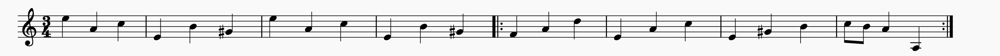
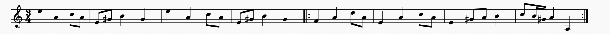

## DCML submission to the AI Music Challenge 2021 
We designed a rule based model to generate Slängpolska melodies iteratively in a controllable manner.
The user can specify the harmony, coherence (similarity among bars), phrase ending, cadence type, rhythmic density, across multiple levels.

Pieces are first generated in C major and A minor and then transposed to D major and A minor.

## Usage
**Code link**

https://github.com/DCMLab/music-generation-challenge-2021

**Dependencies**

- numpy: for numerical computation.
- music21: for building musicxml and midi files from custom melody representation.

**Reproducing the generated pieces**

To generate all the 1000 Slängpolska pieces in both `.xml` and `.mid` format,
run `code/tree_model/run.py`, which put the generated pieces to the two folders: `code/tree_model/generated_midi` and `code/tree_model/generated_xml`. 
The generation process should take less than 5 mins. 

## File Description

**For melody skeleton generation**

`form.py` defined the class for the tree representation of form as well as two specific form called "sentence" and "period" in both major and minor.

`template.py` contains helper functions for preprocessing melody skeleton.

**For melody elaboration**

`melody.py` defines the class for the interval tree representation of melody.

`operation.py` defines all the operations that can be used on a melody during the melody elaboration process.

`tree_policy` defines the policies for determining which action to use given the current state of the melody during the elaboration process

## Model Description

#### Stage 0: Specifying form

The input of the model is a collection of form templates (currently four), which specify the following information on the bar level:

- Harmony
- Markers for coherence structure (which bars should be an exact copy, or similar, or different from each other)
- Flags for phrase endings
- Flags for cadences (perfect authentic cadence or half cadence)
- Numbers of maximum elaboration (to enable the control of rhythmic density)

Here is an example of form template:

| info \ position|1|2|3|4|5|6|7|8
|---|---|---|---|---|---|---|---|---|
|harmony|I|V|I|V|IV|cad64|V|I
|coherence marker|a|b|a|b|c|c'|c''|d
|phrase ending flag|-|True|-|True|-|-|-|True
|cadence flag|-|-|-|HC|-|-|-|PAC
|max_elaboration|-|-|-|-|-|-|-|-

#### Stage 1: Generating Guide Tones

For each non-cadence bar that has a unique coherence marker, we assign a random integer k (from 0 to 6) to each beat. The guide tone for each beat is then determined as the k-th chord tone (in ascending order by pitch height) within a pre-specified piece range. 

To enforce the coherence specified by the form template, we then assign this integer to all bars that have the same coherence marker. 
In the case of cadences, the guide tones are always fixed as scale degrees 3-2, 1, 1 (one octave lower), as in the last bar of the example above.

The guide tones in the example correspond to the example form template. 

#### Stage 2: Elaboration

At each elaboration step, the model performs one operation per bar. 

The list of available elaboration operations is: `LeftRepeat`, `RightRepeat`, `LeftNeighbor`, `RightNeighbor` as well as `Fill`, which is an umbrella operation for both arpeggiation and passing tone.
The choice of operation and location, called `Action`, is determined by a hand-tuned policy called `RhythmBalancedPolicy`. When encountering a bar whose coherence marker is present in a previous bar, another policy called `ImitatingPolicy` is used to determine the action on this bar. This is an essential component that enables imitation of previous materials and thus enforces motivic coherence.  

Here is an example of how the melody is elaborated iteratively from the guide tones (first line) to the final result (last line).

## Model Details:

## Acknowledgements

This project has received funding from the European Research Council
(ERC) under the European Union's Horizon 2020 research and innovation
program under grant agreement No 760081 – PMSB. We thank Claude Latour for supporting this research
through the Latour Chair in Digital Musicology. We additionally thank the members of the Digital and Cognitive Musicology Lab (DCML) for
fruitful discussions.

   
   

